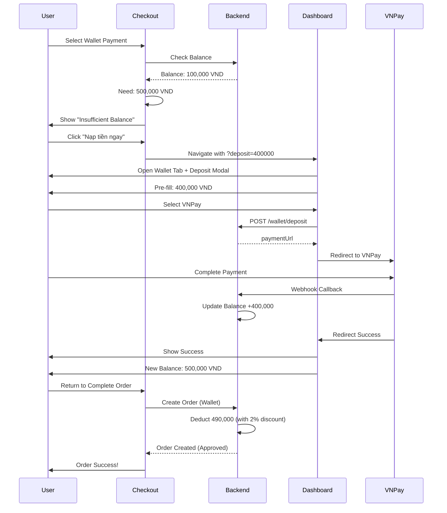

# API Documentation - Homely Store E-Commerce Platform
## Django Backend Integration Guide

> **Hướng dẫn tích hợp Backend Python Django cho hệ thống thương mại điện tử Homely Store**
> **Cập nhật mới nhất**: Bao gồm hệ thống ví điện tử với nạp/rút tiền tự động

---

## 📋 Mục lục

1. [Tổng quan](#tổng-quan)
2. [Cấu trúc Database Models](#cấu-trúc-database-models)
3. [Authentication & Authorization](#authentication--authorization)
4. [API Endpoints](#api-endpoints)
5. [Wallet System (Hệ thống Ví)](#wallet-system)
6. [Payment Integration](#payment-integration)
7. [Request/Response Format](#requestresponse-format)
8. [Error Handling](#error-handling)
9. [File Upload](#file-upload)
10. [Environment Variables](#environment-variables)
11. [URL Parameters & Deep Linking](#url-parameters--deep-linking)

---

## 🎯 Tổng quan

### Base URL
```
Production: https://api.homelystore.vn/api/v1
Development: http://localhost:8000/api/v1
```

### Authentication Method
- **JWT (JSON Web Token)** cho xác thực
- Token được gửi qua header: `Authorization: Bearer <token>`
- Token hết hạn sau 24 giờ
- Refresh token hết hạn sau 7 ngày

### Content Type
- Request: `application/json`
- Response: `application/json`
- File Upload: `multipart/form-data`

### Wallet System Integration
- Hệ thống ví điện tử nội bộ
- Giảm giá 2% khi thanh toán bằng ví
- Nạp tiền qua VNPay, MoMo, Stripe, PayPal
- Rút tiền về tài khoản ngân hàng
- Deep linking: Tự động chuyển đến trang nạp tiền với số tiền cần nạp

---

## 🗄️ Cấu trúc Database Models

### 1. User Model (Django Custom User)

```python
# models.py
from django.contrib.auth.models import AbstractBaseUser, PermissionsMixin
from django.db import models
from django.utils import timezone

class User(AbstractBaseUser, PermissionsMixin):
    """Custom User Model với phân quyền Guest/User/Admin"""
    
    ROLE_CHOICES = [
        ('guest', 'Guest'),
        ('user', 'User'),
        ('admin', 'Admin'),
    ]
    
    id = models.UUIDField(primary_key=True, default=uuid.uuid4, editable=False)
    email = models.EmailField(unique=True, db_index=True)
    name = models.CharField(max_length=255)
    role = models.CharField(max_length=10, choices=ROLE_CHOICES, default='user')
    phone = models.CharField(max_length=20, blank=True, null=True)
    address = models.TextField(blank=True, null=True)
    
    # Security features
    is_locked = models.BooleanField(default=False)
    failed_login_attempts = models.IntegerField(default=0)
    
    # Wallet system
    wallet_balance = models.DecimalField(max_digits=12, decimal_places=2, default=0.00)
    
    # Django required fields
    is_active = models.BooleanField(default=True)
    is_staff = models.BooleanField(default=False)
    is_superuser = models.BooleanField(default=False)
    
    created_at = models.DateTimeField(auto_now_add=True)
    updated_at = models.DateTimeField(auto_now=True)
    
    USERNAME_FIELD = 'email'
    REQUIRED_FIELDS = ['name']
    
    class Meta:
        db_table = 'users'
        ordering = ['-created_at']
        indexes = [
            models.Index(fields=['email']),
            models.Index(fields=['role']),
        ]
```

### 2. ShippingAddress Model

```python
class ShippingAddress(models.Model):
    """Địa chỉ giao hàng của khách hàng"""
    
    id = models.UUIDField(primary_key=True, default=uuid.uuid4, editable=False)
    user = models.ForeignKey(User, on_delete=models.CASCADE, related_name='shipping_addresses')
    name = models.CharField(max_length=255)
    phone = models.CharField(max_length=20)
    address = models.TextField()
    province = models.CharField(max_length=100)
    district = models.CharField(max_length=100)
    ward = models.CharField(max_length=100)
    is_default = models.BooleanField(default=False)
    created_at = models.DateTimeField(auto_now_add=True)
    updated_at = models.DateTimeField(auto_now=True)
    
    class Meta:
        db_table = 'shipping_addresses'
        ordering = ['-is_default', '-created_at']
```

### 3. Product Model

```python
class Product(models.Model):
    """Sản phẩm đồ gia dụng"""
    
    id = models.UUIDField(primary_key=True, default=uuid.uuid4, editable=False)
    name = models.CharField(max_length=255, db_index=True)
    description = models.TextField()
    price = models.DecimalField(max_digits=12, decimal_places=2)
    category = models.CharField(max_length=100, db_index=True)
    brand = models.CharField(max_length=100)
    image = models.ImageField(upload_to='products/', max_length=500)
    stock = models.IntegerField(default=0)
    rating = models.DecimalField(max_digits=3, decimal_places=2, default=0.00)
    featured = models.BooleanField(default=False)
    discount = models.DecimalField(max_digits=5, decimal_places=2, default=0.00)  # Percentage
    tags = models.JSONField(default=list, blank=True)
    created_at = models.DateTimeField(auto_now_add=True)
    updated_at = models.DateTimeField(auto_now=True)
    
    class Meta:
        db_table = 'products'
        ordering = ['-created_at']
        indexes = [
            models.Index(fields=['category']),
            models.Index(fields=['featured']),
            models.Index(fields=['-created_at']),
        ]
```

### 4. ProductImage Model

```python
class ProductImage(models.Model):
    """Nhiều ảnh cho mỗi sản phẩm"""
    
    id = models.UUIDField(primary_key=True, default=uuid.uuid4, editable=False)
    product = models.ForeignKey(Product, on_delete=models.CASCADE, related_name='images')
    image = models.ImageField(upload_to='products/gallery/', max_length=500)
    order = models.IntegerField(default=0)
    created_at = models.DateTimeField(auto_now_add=True)
    
    class Meta:
        db_table = 'product_images'
        ordering = ['order', 'created_at']
```

### 5. Order Model

```python
class Order(models.Model):
    """Đơn hàng"""
    
    STATUS_CHOICES = [
        ('pending', 'Pending'),
        ('approved', 'Approved'),
        ('delivered', 'Delivered'),
        ('awaiting_review', 'Awaiting Review'),
        ('reviewed', 'Reviewed'),
        ('rejected', 'Rejected'),
        ('cancelled', 'Cancelled'),
    ]
    
    PAYMENT_METHOD_CHOICES = [
        ('cod', 'COD'),
        ('vnpay', 'VNPay'),
        ('momo', 'MoMo'),
        ('stripe', 'Stripe'),
        ('paypal', 'PayPal'),
        ('wallet', 'Wallet'),
    ]
    
    PAYMENT_STATUS_CHOICES = [
        ('pending', 'Pending'),
        ('completed', 'Completed'),
        ('failed', 'Failed'),
        ('refunded', 'Refunded'),
    ]
    
    id = models.UUIDField(primary_key=True, default=uuid.uuid4, editable=False)
    user = models.ForeignKey(User, on_delete=models.CASCADE, related_name='orders')
    user_name = models.CharField(max_length=255)
    user_email = models.EmailField()
    total = models.DecimalField(max_digits=12, decimal_places=2)
    status = models.CharField(max_length=20, choices=STATUS_CHOICES, default='pending', db_index=True)
    payment_method = models.CharField(max_length=20, choices=PAYMENT_METHOD_CHOICES, blank=True, null=True)
    payment_status = models.CharField(max_length=20, choices=PAYMENT_STATUS_CHOICES, default='pending')
    wallet_discount = models.DecimalField(max_digits=12, decimal_places=2, default=0.00)
    shipping_address = models.TextField()
    phone = models.CharField(max_length=20)
    notes = models.TextField(blank=True, null=True)
    created_at = models.DateTimeField(auto_now_add=True, db_index=True)
    updated_at = models.DateTimeField(auto_now=True)
    
    class Meta:
        db_table = 'orders'
        ordering = ['-created_at']
        indexes = [
            models.Index(fields=['user', '-created_at']),
            models.Index(fields=['status']),
        ]
```

### 6. OrderItem Model

```python
class OrderItem(models.Model):
    """Chi tiết sản phẩm trong đơn hàng"""
    
    id = models.UUIDField(primary_key=True, default=uuid.uuid4, editable=False)
    order = models.ForeignKey(Order, on_delete=models.CASCADE, related_name='items')
    product = models.ForeignKey(Product, on_delete=models.PROTECT)
    product_name = models.CharField(max_length=255)
    product_image = models.CharField(max_length=500)
    quantity = models.IntegerField()
    price = models.DecimalField(max_digits=12, decimal_places=2)
    created_at = models.DateTimeField(auto_now_add=True)
    
    class Meta:
        db_table = 'order_items'
```

### 7. ProductReview Model

```python
class ProductReview(models.Model):
    """Đánh giá sản phẩm"""
    
    STATUS_CHOICES = [
        ('pending', 'Pending'),
        ('approved', 'Approved'),
        ('rejected', 'Rejected'),
    ]
    
    id = models.UUIDField(primary_key=True, default=uuid.uuid4, editable=False)
    order = models.ForeignKey(Order, on_delete=models.CASCADE)
    product = models.ForeignKey(Product, on_delete=models.CASCADE, related_name='reviews')
    user = models.ForeignKey(User, on_delete=models.CASCADE)
    rating = models.IntegerField()  # 1-5
    comment = models.TextField()
    status = models.CharField(max_length=20, choices=STATUS_CHOICES, default='pending')
    created_at = models.DateTimeField(auto_now_add=True)
    updated_at = models.DateTimeField(auto_now=True)
    
    class Meta:
        db_table = 'product_reviews'
        unique_together = ['order', 'product']
        ordering = ['-created_at']
```

### 8. WalletTransaction Model

```python
class WalletTransaction(models.Model):
    """Lịch sử giao dịch ví điện tử"""
    
    TYPE_CHOICES = [
        ('deposit', 'Deposit'),
        ('withdrawal', 'Withdrawal'),
        ('payment', 'Payment'),
        ('refund', 'Refund'),
    ]
    
    STATUS_CHOICES = [
        ('pending', 'Pending'),
        ('completed', 'Completed'),
        ('failed', 'Failed'),
    ]
    
    id = models.UUIDField(primary_key=True, default=uuid.uuid4, editable=False)
    user = models.ForeignKey(User, on_delete=models.CASCADE, related_name='wallet_transactions')
    type = models.CharField(max_length=20, choices=TYPE_CHOICES)
    amount = models.DecimalField(max_digits=12, decimal_places=2)
    balance_before = models.DecimalField(max_digits=12, decimal_places=2)
    balance_after = models.DecimalField(max_digits=12, decimal_places=2)
    description = models.TextField()
    status = models.CharField(max_length=20, choices=STATUS_CHOICES, default='pending')
    created_at = models.DateTimeField(auto_now_add=True)
    
    class Meta:
        db_table = 'wallet_transactions'
        ordering = ['-created_at']
```

### 9. Wishlist Model

```python
class Wishlist(models.Model):
    """Danh sách yêu thích"""
    
    id = models.UUIDField(primary_key=True, default=uuid.uuid4, editable=False)
    user = models.OneToOneField(User, on_delete=models.CASCADE, related_name='wishlist')
    products = models.ManyToManyField(Product, related_name='wishlisted_by')
    created_at = models.DateTimeField(auto_now_add=True)
    updated_at = models.DateTimeField(auto_now=True)
    
    class Meta:
        db_table = 'wishlists'
```

### 10. Coupon Model

```python
class Coupon(models.Model):
    """Mã giảm giá"""
    
    DISCOUNT_TYPE_CHOICES = [
        ('percentage', 'Percentage'),
        ('fixed', 'Fixed'),
    ]
    
    id = models.UUIDField(primary_key=True, default=uuid.uuid4, editable=False)
    code = models.CharField(max_length=50, unique=True, db_index=True)
    description = models.TextField()
    discount_type = models.CharField(max_length=20, choices=DISCOUNT_TYPE_CHOICES)
    discount_value = models.DecimalField(max_digits=12, decimal_places=2)
    min_order_value = models.DecimalField(max_digits=12, decimal_places=2)
    max_discount_value = models.DecimalField(max_digits=12, decimal_places=2, blank=True, null=True)
    expires_at = models.DateTimeField()
    usage_limit = models.IntegerField()
    usage_count = models.IntegerField(default=0)
    is_active = models.BooleanField(default=True)
    created_at = models.DateTimeField(auto_now_add=True)
    
    class Meta:
        db_table = 'coupons'
        ordering = ['-created_at']
```

---

## 🔐 Authentication & Authorization

### 1. Register (Đăng ký)

**Endpoint:** `POST /api/v1/auth/register`

**Request Body:**
```json
{
  "email": "user@example.com",
  "password": "SecurePassword123!",
  "name": "Nguyen Van A",
  "phone": "0901234567"
}
```

**Response Success (201):**
```json
{
  "success": true,
  "data": {
    "user": {
      "id": "uuid-here",
      "email": "user@example.com",
      "name": "Nguyen Van A",
      "role": "user",
      "phone": "0901234567",
      "walletBalance": 0.00,
      "createdAt": "2024-03-11T10:00:00Z"
    },
    "access_token": "eyJhbGciOiJIUzI1NiIsInR5cCI6IkpXVCJ9...",
    "refresh_token": "eyJhbGciOiJIUzI1NiIsInR5cCI6IkpXVCJ9..."
  },
  "message": "Đăng ký thành công"
}
```

**Response Error (400):**
```json
{
  "success": false,
  "error": "Email đã được sử dụng"
}
```

### 2. Login (Đăng nhập)

**Endpoint:** `POST /api/v1/auth/login`

**Request Body:**
```json
{
  "email": "user@example.com",
  "password": "SecurePassword123!"
}
```

**Response Success (200):**
```json
{
  "success": true,
  "data": {
    "user": {
      "id": "uuid-here",
      "email": "user@example.com",
      "name": "Nguyen Van A",
      "role": "user",
      "phone": "0901234567",
      "walletBalance": 150000.00,
      "failedLoginAttempts": 0,
      "isLocked": false,
      "createdAt": "2024-03-11T10:00:00Z"
    },
    "access_token": "eyJhbGciOiJIUzI1NiIsInR5cCI6IkpXVCJ9...",
    "refresh_token": "eyJhbGciOiJIUzI1NiIsInR5cCI6IkpXVCJ9..."
  },
  "message": "Đăng nhập thành công"
}
```

**Response Error - Wrong Password (401):**
```json
{
  "success": false,
  "error": "Email hoặc mật khẩu không đúng. Còn 4 lần thử.",
  "failedAttempts": 1,
  "remainingAttempts": 4
}
```

**Response Error - Account Locked (403):**
```json
{
  "success": false,
  "error": "Tài khoản đã bị khóa do đăng nhập sai 5 lần. Vui lòng liên hệ admin."
}
```

### 3. Forgot Password (Quên mật khẩu)

**Endpoint:** `POST /api/v1/auth/forgot-password`

**Request Body:**
```json
{
  "email": "user@example.com"
}
```

**Response Success (200):**
```json
{
  "success": true,
  "message": "Mật khẩu mới đã được gửi đến email của bạn"
}
```

### 4. Refresh Token

**Endpoint:** `POST /api/v1/auth/refresh`

**Request Body:**
```json
{
  "refresh_token": "eyJhbGciOiJIUzI1NiIsInR5cCI6IkpXVCJ9..."
}
```

**Response Success (200):**
```json
{
  "success": true,
  "data": {
    "access_token": "eyJhbGciOiJIUzI1NiIsInR5cCI6IkpXVCJ9..."
  }
}
```

### 5. Logout

**Endpoint:** `POST /api/v1/auth/logout`

**Headers:**
```
Authorization: Bearer <access_token>
```

**Response Success (200):**
```json
{
  "success": true,
  "message": "Đăng xuất thành công"
}
```

---

## 📦 Products API

### 1. Get All Products (Lấy tất cả sản phẩm)

**Endpoint:** `GET /api/v1/products`

**Query Parameters:**
```
?category=living-room
&brand=ikea
&minPrice=100000
&maxPrice=5000000
&search=bàn ăn
&featured=true
&sort=price_asc|price_desc|newest|popular
&page=1
&limit=20
```

**Response Success (200):**
```json
{
  "success": true,
  "data": {
    "products": [
      {
        "id": "uuid-here",
        "name": "Bàn ăn gỗ sồi tự nhiên 6 ghế",
        "description": "Bàn ăn cao cấp...",
        "price": 8900000.00,
        "category": "dining-room",
        "brand": "IKEA",
        "image": "https://api.homelystore.vn/media/products/ban-an-01.jpg",
        "images": [
          "https://api.homelystore.vn/media/products/gallery/ban-an-01-1.jpg",
          "https://api.homelystore.vn/media/products/gallery/ban-an-01-2.jpg"
        ],
        "stock": 25,
        "rating": 4.8,
        "featured": true,
        "discount": 15.00,
        "tags": ["best-seller", "eco-friendly"],
        "createdAt": "2024-03-01T10:00:00Z",
        "updatedAt": "2024-03-11T10:00:00Z"
      }
    ],
    "pagination": {
      "total": 150,
      "page": 1,
      "limit": 20,
      "totalPages": 8
    }
  }
}
```

### 2. Get Product by ID (Lấy chi tiết sản phẩm)

**Endpoint:** `GET /api/v1/products/{id}`

**Response Success (200):**
```json
{
  "success": true,
  "data": {
    "id": "uuid-here",
    "name": "Bàn ăn gỗ sồi tự nhiên 6 ghế",
    "description": "Bàn ăn cao cấp từ gỗ sồi tự nhiên...",
    "price": 8900000.00,
    "category": "dining-room",
    "brand": "IKEA",
    "image": "https://api.homelystore.vn/media/products/ban-an-01.jpg",
    "images": [
      "https://api.homelystore.vn/media/products/gallery/ban-an-01-1.jpg",
      "https://api.homelystore.vn/media/products/gallery/ban-an-01-2.jpg",
      "https://api.homelystore.vn/media/products/gallery/ban-an-01-3.jpg"
    ],
    "stock": 25,
    "rating": 4.8,
    "featured": true,
    "discount": 15.00,
    "tags": ["best-seller", "eco-friendly"],
    "reviews": [
      {
        "id": "uuid-here",
        "userId": "uuid-here",
        "userName": "Nguyen Van A",
        "rating": 5,
        "comment": "Sản phẩm rất tốt!",
        "status": "approved",
        "createdAt": "2024-03-10T10:00:00Z"
      }
    ],
    "createdAt": "2024-03-01T10:00:00Z",
    "updatedAt": "2024-03-11T10:00:00Z"
  }
}
```

### 3. Create Product (Tạo sản phẩm mới - Admin only)

**Endpoint:** `POST /api/v1/products`

**Headers:**
```
Authorization: Bearer <admin_access_token>
Content-Type: multipart/form-data
```

**Request Body (Form Data):**
```
name: Bàn ăn gỗ sồi tự nhiên 6 ghế
description: Bàn ăn cao cấp từ gỗ sồi tự nhiên...
price: 8900000.00
category: dining-room
brand: IKEA
stock: 25
featured: true
discount: 15.00
tags: ["best-seller", "eco-friendly"]
image: <file> (JPG/PNG, max 2MB)
gallery_images: <file[]> (Multiple files, max 2MB each)
```

**Response Success (201):**
```json
{
  "success": true,
  "data": {
    "id": "uuid-here",
    "name": "Bàn ăn gỗ sồi tự nhiên 6 ghế",
    "price": 8900000.00,
    ...
  },
  "message": "Tạo sản phẩm thành công"
}
```

**Validation Rules:**
- `name`: Required, max 255 chars
- `price`: Required, > 0
- `stock`: Required, >= 0
- `image`: Required, JPG/PNG, max 2MB
- `gallery_images`: Optional, max 5 images, each max 2MB

### 4. Update Product (Cập nhật sản phẩm - Admin only)

**Endpoint:** `PUT /api/v1/products/{id}`

**Headers:**
```
Authorization: Bearer <admin_access_token>
Content-Type: multipart/form-data
```

**Request Body:** Same as Create Product

**Response Success (200):**
```json
{
  "success": true,
  "data": {
    "id": "uuid-here",
    "name": "Bàn ăn gỗ sồi tự nhiên 6 ghế",
    ...
  },
  "message": "Cập nhật sản phẩm thành công"
}
```

### 5. Delete Product (Xóa sản phẩm - Admin only)

**Endpoint:** `DELETE /api/v1/products/{id}`

**Headers:**
```
Authorization: Bearer <admin_access_token>
```

**Response Success (200):**
```json
{
  "success": true,
  "message": "Xóa sản phẩm thành công"
}
```

---

## 🛒 Orders API

### 1. Create Order (Tạo đơn hàng)

**Endpoint:** `POST /api/v1/orders`

**Headers:**
```
Authorization: Bearer <access_token> (Optional for guest)
```

**Request Body:**
```json
{
  "userId": "uuid-here",
  "userName": "Nguyen Van A",
  "userEmail": "user@example.com",
  "items": [
    {
      "productId": "uuid-here",
      "productName": "Bàn ăn gỗ sồi",
      "productImage": "https://...",
      "quantity": 1,
      "price": 8900000.00
    }
  ],
  "total": 8900000.00,
  "paymentMethod": "vnpay",
  "walletDiscount": 178000.00,
  "shippingAddress": "123 Nguyen Hue, Q1, TPHCM",
  "phone": "0901234567",
  "notes": "Giao hàng giờ hành chính"
}
```

**Response Success (201):**
```json
{
  "success": true,
  "data": {
    "id": "uuid-here",
    "userId": "uuid-here",
    "userName": "Nguyen Van A",
    "userEmail": "user@example.com",
    "items": [...],
    "total": 8900000.00,
    "status": "approved",
    "paymentMethod": "vnpay",
    "paymentStatus": "completed",
    "walletDiscount": 178000.00,
    "shippingAddress": "123 Nguyen Hue, Q1, TPHCM",
    "phone": "0901234567",
    "notes": "Giao hàng giờ hành chính",
    "createdAt": "2024-03-11T10:00:00Z",
    "updatedAt": "2024-03-11T10:00:00Z",
    "paymentUrl": "https://vnpay.vn/payment?token=..." 
  },
  "message": "Đặt hàng thành công"
}
```

**Business Logic:**
- Nếu `paymentMethod` là `vnpay`, `momo`, `stripe`, `paypal` → `status` = `approved` (Tự động duyệt)
- Nếu `paymentMethod` là `cod` → `status` = `pending` (Chờ admin duyệt)
- Nếu `paymentMethod` là `wallet` → Trừ tiền ví + giảm 2% + `status` = `approved`
- Kiểm tra đủ số dư ví trước khi thanh toán

### 2. Get All Orders (Admin - Lấy tất cả đơn hàng)

**Endpoint:** `GET /api/v1/orders`

**Headers:**
```
Authorization: Bearer <admin_access_token>
```

**Query Parameters:**
```
?status=pending
&userId=uuid-here
&startDate=2024-03-01
&endDate=2024-03-31
&page=1
&limit=20
```

**Response Success (200):**
```json
{
  "success": true,
  "data": {
    "orders": [
      {
        "id": "uuid-here",
        "userId": "uuid-here",
        "userName": "Nguyen Van A",
        "userEmail": "user@example.com",
        "items": [...],
        "total": 8900000.00,
        "status": "pending",
        "paymentMethod": "cod",
        "paymentStatus": "pending",
        "createdAt": "2024-03-11T10:00:00Z",
        "updatedAt": "2024-03-11T10:00:00Z"
      }
    ],
    "pagination": {
      "total": 50,
      "page": 1,
      "limit": 20,
      "totalPages": 3
    }
  }
}
```

### 3. Get My Orders (User - Đơn hàng của tôi)

**Endpoint:** `GET /api/v1/orders/my-orders`

**Headers:**
```
Authorization: Bearer <access_token>
```

**Response Success (200):**
```json
{
  "success": true,
  "data": [
    {
      "id": "uuid-here",
      "items": [...],
      "total": 8900000.00,
      "status": "delivered",
      "paymentMethod": "vnpay",
      "paymentStatus": "completed",
      "createdAt": "2024-03-11T10:00:00Z",
      "updatedAt": "2024-03-11T10:00:00Z"
    }
  ]
}
```

### 4. Update Order Status (Admin - Cập nhật trạng thái đơn hàng)

**Endpoint:** `PATCH /api/v1/orders/{id}/status`

**Headers:**
```
Authorization: Bearer <admin_access_token>
```

**Request Body:**
```json
{
  "status": "approved"
}
```

**Response Success (200):**
```json
{
  "success": true,
  "data": {
    "id": "uuid-here",
    "status": "approved",
    "updatedAt": "2024-03-11T10:05:00Z"
  },
  "message": "Cập nhật trạng thái đơn hàng thành công"
}
```

**Valid Status Transitions:**
```
pending → approved | rejected | cancelled
approved → delivered | cancelled
delivered → awaiting_review
awaiting_review → reviewed
```

### 5. Cancel Order (Hủy đơn hàng)

**Endpoint:** `PATCH /api/v1/orders/{id}/cancel`

**Headers:**
```
Authorization: Bearer <access_token>
```

**Response Success (200):**
```json
{
  "success": true,
  "data": {
    "id": "uuid-here",
    "status": "cancelled",
    "refundAmount": 8900000.00,
    "updatedAt": "2024-03-11T10:05:00Z"
  },
  "message": "Hủy đơn hàng thành công. Tiền đã được hoàn vào ví."
}
```

---

## 👤 Users API

### 1. Get All Users (Admin only)

**Endpoint:** `GET /api/v1/users`

**Headers:**
```
Authorization: Bearer <admin_access_token>
```

**Query Parameters:**
```
?role=user
&search=nguyen
&isLocked=false
&page=1
&limit=20
```

**Response Success (200):**
```json
{
  "success": true,
  "data": {
    "users": [
      {
        "id": "uuid-here",
        "email": "user@example.com",
        "name": "Nguyen Van A",
        "role": "user",
        "phone": "0901234567",
        "walletBalance": 150000.00,
        "isLocked": false,
        "failedLoginAttempts": 0,
        "createdAt": "2024-03-01T10:00:00Z"
      }
    ],
    "pagination": {
      "total": 100,
      "page": 1,
      "limit": 20,
      "totalPages": 5
    }
  }
}
```

### 2. Get User Profile (Lấy thông tin cá nhân)

**Endpoint:** `GET /api/v1/users/profile`

**Headers:**
```
Authorization: Bearer <access_token>
```

**Response Success (200):**
```json
{
  "success": true,
  "data": {
    "id": "uuid-here",
    "email": "user@example.com",
    "name": "Nguyen Van A",
    "role": "user",
    "phone": "0901234567",
    "address": "123 Nguyen Hue, Q1, TPHCM",
    "walletBalance": 150000.00,
    "shippingAddresses": [
      {
        "id": "uuid-here",
        "name": "Nguyen Van A",
        "phone": "0901234567",
        "address": "123 Nguyen Hue",
        "province": "TP. Hồ Chí Minh",
        "district": "Quận 1",
        "ward": "Phường Bến Nghé",
        "isDefault": true
      }
    ],
    "createdAt": "2024-03-01T10:00:00Z"
  }
}
```

### 3. Update User Profile (Cập nhật thông tin)

**Endpoint:** `PUT /api/v1/users/profile`

**Headers:**
```
Authorization: Bearer <access_token>
```

**Request Body:**
```json
{
  "name": "Nguyen Van A",
  "phone": "0901234567",
  "address": "123 Nguyen Hue, Q1, TPHCM"
}
```

**Response Success (200):**
```json
{
  "success": true,
  "data": {
    "id": "uuid-here",
    "name": "Nguyen Van A",
    "phone": "0901234567",
    "address": "123 Nguyen Hue, Q1, TPHCM",
    "updatedAt": "2024-03-11T10:00:00Z"
  },
  "message": "Cập nhật thông tin thành công"
}
```

### 4. Lock/Unlock User (Admin only)

**Endpoint:** `PATCH /api/v1/users/{id}/lock`

**Headers:**
```
Authorization: Bearer <admin_access_token>
```

**Request Body:**
```json
{
  "isLocked": true
}
```

**Response Success (200):**
```json
{
  "success": true,
  "data": {
    "id": "uuid-here",
    "isLocked": true,
    "updatedAt": "2024-03-11T10:00:00Z"
  },
  "message": "Khóa tài khoản thành công"
}
```

---

## 💰 Wallet API

### 1. Get Wallet Balance (Lấy số dư ví)

**Endpoint:** `GET /api/v1/wallet/balance`

**Headers:**
```
Authorization: Bearer <access_token>
```

**Response Success (200):**
```json
{
  "success": true,
  "data": {
    "userId": "uuid-here",
    "balance": 150000.00,
    "currency": "VND"
  }
}
```

### 2. Deposit to Wallet (Nạp tiền vào ví)

**Endpoint:** `POST /api/v1/wallet/deposit`

**Headers:**
```
Authorization: Bearer <access_token>
```

**Request Body:**
```json
{
  "amount": 500000.00,
  "paymentMethod": "vnpay"
}
```

**Response Success (200):**
```json
{
  "success": true,
  "data": {
    "transactionId": "uuid-here",
    "userId": "uuid-here",
    "type": "deposit",
    "amount": 500000.00,
    "balanceBefore": 150000.00,
    "balanceAfter": 650000.00,
    "status": "completed",
    "paymentUrl": "https://vnpay.vn/payment?token=...",
    "createdAt": "2024-03-11T10:00:00Z"
  },
  "message": "Nạp tiền thành công"
}
```

### 3. Withdraw from Wallet (Rút tiền từ ví)

**Endpoint:** `POST /api/v1/wallet/withdraw`

**Headers:**
```
Authorization: Bearer <access_token>
```

**Request Body:**
```json
{
  "amount": 100000.00,
  "bankAccount": "1234567890",
  "bankName": "Vietcombank"
}
```

**Response Success (200):**
```json
{
  "success": true,
  "data": {
    "transactionId": "uuid-here",
    "userId": "uuid-here",
    "type": "withdrawal",
    "amount": 100000.00,
    "balanceBefore": 650000.00,
    "balanceAfter": 550000.00,
    "status": "pending",
    "createdAt": "2024-03-11T10:00:00Z"
  },
  "message": "Yêu cầu rút tiền đã được gửi. Vui lòng chờ xử lý."
}
```

### 4. Get Wallet Transactions (Lịch sử giao dịch)

**Endpoint:** `GET /api/v1/wallet/transactions`

**Headers:**
```
Authorization: Bearer <access_token>
```

**Query Parameters:**
```
?type=deposit
&status=completed
&startDate=2024-03-01
&endDate=2024-03-31
&page=1
&limit=20
```

**Response Success (200):**
```json
{
  "success": true,
  "data": {
    "transactions": [
      {
        "id": "uuid-here",
        "type": "deposit",
        "amount": 500000.00,
        "balanceBefore": 150000.00,
        "balanceAfter": 650000.00,
        "description": "Nạp tiền qua VNPay",
        "status": "completed",
        "createdAt": "2024-03-11T10:00:00Z"
      }
    ],
    "pagination": {
      "total": 25,
      "page": 1,
      "limit": 20,
      "totalPages": 2
    }
  }
}
```

---

## ⭐ Reviews API

### 1. Create Review (Tạo đánh giá)

**Endpoint:** `POST /api/v1/reviews`

**Headers:**
```
Authorization: Bearer <access_token>
```

**Request Body:**
```json
{
  "orderId": "uuid-here",
  "productId": "uuid-here",
  "rating": 5,
  "comment": "Sản phẩm rất tốt, giao hàng nhanh!"
}
```

**Response Success (201):**
```json
{
  "success": true,
  "data": {
    "id": "uuid-here",
    "orderId": "uuid-here",
    "productId": "uuid-here",
    "productName": "Bàn ăn gỗ sồi",
    "userId": "uuid-here",
    "userName": "Nguyen Van A",
    "rating": 5,
    "comment": "Sản phẩm rất tốt, giao hàng nhanh!",
    "status": "pending",
    "createdAt": "2024-03-11T10:00:00Z"
  },
  "message": "Gửi đánh giá thành công. Đang chờ admin duyệt."
}
```

### 2. Get All Reviews (Admin - Lấy tất cả đánh giá)

**Endpoint:** `GET /api/v1/reviews`

**Headers:**
```
Authorization: Bearer <admin_access_token>
```

**Query Parameters:**
```
?status=pending
&productId=uuid-here
&page=1
&limit=20
```

**Response Success (200):**
```json
{
  "success": true,
  "data": {
    "reviews": [
      {
        "id": "uuid-here",
        "orderId": "uuid-here",
        "productId": "uuid-here",
        "productName": "Bàn ăn gỗ sồi",
        "userId": "uuid-here",
        "userName": "Nguyen Van A",
        "rating": 5,
        "comment": "Sản phẩm rất tốt!",
        "status": "pending",
        "createdAt": "2024-03-11T10:00:00Z"
      }
    ],
    "pagination": {
      "total": 15,
      "page": 1,
      "limit": 20,
      "totalPages": 1
    }
  }
}
```

### 3. Update Review Status (Admin - Duyệt/Từ chối đánh giá)

**Endpoint:** `PATCH /api/v1/reviews/{id}/status`

**Headers:**
```
Authorization: Bearer <admin_access_token>
```

**Request Body:**
```json
{
  "status": "approved"
}
```

**Response Success (200):**
```json
{
  "success": true,
  "data": {
    "id": "uuid-here",
    "status": "approved",
    "updatedAt": "2024-03-11T10:05:00Z"
  },
  "message": "Duyệt đánh giá thành công"
}
```

---

## ❤️ Wishlist API

### 1. Get My Wishlist (Lấy danh sách yêu thích)

**Endpoint:** `GET /api/v1/wishlist`

**Headers:**
```
Authorization: Bearer <access_token>
```

**Response Success (200):**
```json
{
  "success": true,
  "data": {
    "userId": "uuid-here",
    "products": [
      {
        "id": "uuid-here",
        "name": "Bàn ăn gỗ sồi",
        "price": 8900000.00,
        "image": "https://...",
        "stock": 25,
        "rating": 4.8
      }
    ]
  }
}
```

### 2. Add to Wishlist (Thêm vào yêu thích)

**Endpoint:** `POST /api/v1/wishlist`

**Headers:**
```
Authorization: Bearer <access_token>
```

**Request Body:**
```json
{
  "productId": "uuid-here"
}
```

**Response Success (201):**
```json
{
  "success": true,
  "message": "Đã thêm vào danh sách yêu thích"
}
```

### 3. Remove from Wishlist (Xóa khỏi yêu thích)

**Endpoint:** `DELETE /api/v1/wishlist/{productId}`

**Headers:**
```
Authorization: Bearer <access_token>
```

**Response Success (200):**
```json
{
  "success": true,
  "message": "Đã xóa khỏi danh sách yêu thích"
}
```

---

## 🏷️ Coupons API

### 1. Get All Coupons (Lấy tất cả mã giảm giá)

**Endpoint:** `GET /api/v1/coupons`

**Query Parameters:**
```
?isActive=true
```

**Response Success (200):**
```json
{
  "success": true,
  "data": [
    {
      "id": "uuid-here",
      "code": "WELCOME10",
      "description": "Giảm 10% cho đơn hàng đầu tiên",
      "discountType": "percentage",
      "discountValue": 10.00,
      "minOrderValue": 500000.00,
      "maxDiscountValue": 100000.00,
      "expiresAt": "2024-12-31T23:59:59Z",
      "usageLimit": 1000,
      "usageCount": 250,
      "isActive": true,
      "createdAt": "2024-01-01T00:00:00Z"
    }
  ]
}
```

### 2. Validate Coupon (Kiểm tra mã giảm giá)

**Endpoint:** `POST /api/v1/coupons/validate`

**Request Body:**
```json
{
  "code": "WELCOME10",
  "orderValue": 1000000.00
}
```

**Response Success (200):**
```json
{
  "success": true,
  "data": {
    "valid": true,
    "discountAmount": 100000.00,
    "finalAmount": 900000.00
  }
}
```

**Response Error (400):**
```json
{
  "success": false,
  "error": "Mã giảm giá đã hết hạn"
}
```

---

## 💳 Payment Integration

### VNPay Integration

**Endpoint:** `POST /api/v1/payments/vnpay/create`

**Request Body:**
```json
{
  "orderId": "uuid-here",
  "amount": 8900000.00,
  "returnUrl": "https://homelystore.vn/checkout/success",
  "cancelUrl": "https://homelystore.vn/checkout/cancel"
}
```

**Response Success (200):**
```json
{
  "success": true,
  "data": {
    "paymentUrl": "https://sandbox.vnpayment.vn/paymentv2/vpcpay.html?vnp_...",
    "transactionId": "uuid-here"
  }
}
```

**Webhook Callback:** `POST /api/v1/payments/vnpay/callback`

**VNPay sends:**
```json
{
  "vnp_TxnRef": "uuid-here",
  "vnp_Amount": "890000000",
  "vnp_ResponseCode": "00",
  "vnp_TransactionStatus": "00",
  "vnp_SecureHash": "..."
}
```

**Django Backend Processing:**
```python
# views.py
@csrf_exempt
def vnpay_callback(request):
    # 1. Verify vnp_SecureHash
    # 2. Update order status to 'approved' if payment success
    # 3. Update payment_status to 'completed'
    # 4. Reduce product stock
    # 5. Send email notification
    return JsonResponse({'success': True})
```

### MoMo Integration

**Endpoint:** `POST /api/v1/payments/momo/create`

**Similar structure to VNPay**

### Stripe Integration

**Endpoint:** `POST /api/v1/payments/stripe/create`

**Similar structure to VNPay**

### PayPal Integration

**Endpoint:** `POST /api/v1/payments/paypal/create`

**Similar structure to VNPay**

---

## 📤 File Upload

### Upload Product Images

**Endpoint:** `POST /api/v1/upload/product-images`

**Headers:**
```
Authorization: Bearer <admin_access_token>
Content-Type: multipart/form-data
```

**Request Body:**
```
image: <file> (Required)
gallery_images: <file[]> (Optional)
```

**Response Success (200):**
```json
{
  "success": true,
  "data": {
    "mainImage": "https://api.homelystore.vn/media/products/ban-an-01.jpg",
    "galleryImages": [
      "https://api.homelystore.vn/media/products/gallery/ban-an-01-1.jpg",
      "https://api.homelystore.vn/media/products/gallery/ban-an-01-2.jpg"
    ]
  }
}
```

**File Validation:**
- Allowed formats: JPG, PNG, WEBP
- Max file size: 2MB per file
- Max gallery images: 5 files

---

## ❌ Error Handling

### Error Response Format

```json
{
  "success": false,
  "error": "Chi tiết lỗi ở đây",
  "code": "ERROR_CODE",
  "timestamp": "2024-03-11T10:00:00Z"
}
```

### Common Error Codes

| HTTP Status | Error Code | Description |
|------------|-----------|-------------|
| 400 | `VALIDATION_ERROR` | Dữ liệu đầu vào không hợp lệ |
| 401 | `UNAUTHORIZED` | Chưa đăng nhập |
| 403 | `FORBIDDEN` | Không có quyền truy cập |
| 404 | `NOT_FOUND` | Không tìm thấy tài nguyên |
| 409 | `CONFLICT` | Xung đột dữ liệu (email đã tồn tại) |
| 422 | `UNPROCESSABLE_ENTITY` | Không thể xử lý request |
| 429 | `TOO_MANY_REQUESTS` | Quá nhiều request |
| 500 | `INTERNAL_SERVER_ERROR` | Lỗi server |

---

## 🔧 Environment Variables

### Django `.env` File

```bash
# Django Settings
DEBUG=False
SECRET_KEY=your-secret-key-here
ALLOWED_HOSTS=api.homelystore.vn,localhost,127.0.0.1

# Database (PostgreSQL recommended)
DB_ENGINE=django.db.backends.postgresql
DB_NAME=homelystore_db
DB_USER=postgres
DB_PASSWORD=your-db-password
DB_HOST=localhost
DB_PORT=5432

# JWT Settings
JWT_SECRET_KEY=your-jwt-secret-key
JWT_ACCESS_TOKEN_LIFETIME=86400  # 24 hours in seconds
JWT_REFRESH_TOKEN_LIFETIME=604800  # 7 days in seconds

# CORS Settings
CORS_ALLOWED_ORIGINS=https://homelystore.vn,http://localhost:3000

# Media Files (AWS S3 or Local)
MEDIA_URL=/media/
MEDIA_ROOT=/var/www/homelystore/media/

# AWS S3 (if using)
AWS_ACCESS_KEY_ID=your-aws-access-key
AWS_SECRET_ACCESS_KEY=your-aws-secret-key
AWS_STORAGE_BUCKET_NAME=homelystore-media
AWS_S3_REGION_NAME=ap-southeast-1

# Email Settings (SMTP)
EMAIL_BACKEND=django.core.mail.backends.smtp.EmailBackend
EMAIL_HOST=smtp.gmail.com
EMAIL_PORT=587
EMAIL_USE_TLS=True
EMAIL_HOST_USER=noreply@homelystore.vn
EMAIL_HOST_PASSWORD=your-email-password

# Payment Gateways
VNPAY_TMN_CODE=your-vnpay-tmn-code
VNPAY_HASH_SECRET=your-vnpay-hash-secret
VNPAY_URL=https://sandbox.vnpayment.vn/paymentv2/vpcpay.html
VNPAY_RETURN_URL=https://homelystore.vn/checkout/success

MOMO_PARTNER_CODE=your-momo-partner-code
MOMO_ACCESS_KEY=your-momo-access-key
MOMO_SECRET_KEY=your-momo-secret-key
MOMO_ENDPOINT=https://test-payment.momo.vn/v2/gateway/api/create

STRIPE_PUBLIC_KEY=pk_test_...
STRIPE_SECRET_KEY=sk_test_...

PAYPAL_CLIENT_ID=your-paypal-client-id
PAYPAL_CLIENT_SECRET=your-paypal-client-secret
PAYPAL_MODE=sandbox  # or live

# Redis (for caching and sessions)
REDIS_HOST=localhost
REDIS_PORT=6379
REDIS_DB=0

# Celery (for async tasks)
CELERY_BROKER_URL=redis://localhost:6379/1
CELERY_RESULT_BACKEND=redis://localhost:6379/2
```

---

## 📊 Statistics API (Admin Only)

### Dashboard Statistics

**Endpoint:** `GET /api/v1/admin/statistics/dashboard`

**Headers:**
```
Authorization: Bearer <admin_access_token>
```

**Response Success (200):**
```json
{
  "success": true,
  "data": {
    "revenue": {
      "today": 15000000.00,
      "thisMonth": 350000000.00,
      "total": 2500000000.00,
      "growth": 15.5
    },
    "orders": {
      "pending": 12,
      "approved": 45,
      "delivered": 234,
      "total": 291
    },
    "users": {
      "total": 1250,
      "newThisMonth": 85,
      "active": 980
    },
    "products": {
      "total": 150,
      "lowStock": 8,
      "outOfStock": 2
    },
    "topProducts": [
      {
        "id": "uuid-here",
        "name": "Bàn ăn gỗ sồi",
        "soldCount": 45,
        "revenue": 400500000.00
      }
    ],
    "recentOrders": [...],
    "pendingReviews": 5
  }
}
```

---

## 🔐 Security Best Practices

### 1. Password Hashing
```python
from django.contrib.auth.hashers import make_password, check_password

# When creating user
user.password = make_password(password)

# When logging in
if check_password(password, user.password):
    # Login success
```

### 2. Rate Limiting
```python
# settings.py
REST_FRAMEWORK = {
    'DEFAULT_THROTTLE_CLASSES': [
        'rest_framework.throttling.AnonRateThrottle',
        'rest_framework.throttling.UserRateThrottle'
    ],
    'DEFAULT_THROTTLE_RATES': {
        'anon': '100/hour',
        'user': '1000/hour'
    }
}
```

### 3. CSRF Protection
- Use Django's built-in CSRF middleware
- Exempt webhook endpoints with `@csrf_exempt`

### 4. SQL Injection Prevention
- Always use Django ORM query methods
- Never use raw SQL with user input

### 5. XSS Protection
- Django templates auto-escape by default
- Be careful with `safe` filter

---

## 📝 Django Implementation Example

### views.py Example

```python
from rest_framework.decorators import api_view, permission_classes
from rest_framework.permissions import IsAuthenticated, IsAdminUser
from rest_framework.response import Response
from rest_framework import status
from .models import Product, Order
from .serializers import ProductSerializer, OrderSerializer

@api_view(['GET'])
def get_products(request):
    """Get all products with filters"""
    category = request.GET.get('category')
    search = request.GET.get('search')
    
    products = Product.objects.all()
    
    if category:
        products = products.filter(category=category)
    
    if search:
        products = products.filter(name__icontains=search)
    
    serializer = ProductSerializer(products, many=True)
    return Response({
        'success': True,
        'data': serializer.data
    })

@api_view(['POST'])
@permission_classes([IsAuthenticated])
def create_order(request):
    """Create new order"""
    serializer = OrderSerializer(data=request.data)
    
    if serializer.is_valid():
        order = serializer.save(user=request.user)
        
        # Auto-approve if online payment
        if order.payment_method in ['vnpay', 'momo', 'stripe', 'paypal']:
            order.status = 'approved'
            order.save()
        
        return Response({
            'success': True,
            'data': OrderSerializer(order).data,
            'message': 'Đặt hàng thành công'
        }, status=status.HTTP_201_CREATED)
    
    return Response({
        'success': False,
        'error': serializer.errors
    }, status=status.HTTP_400_BAD_REQUEST)
```

### serializers.py Example

```python
from rest_framework import serializers
from .models import Product, Order, OrderItem

class ProductSerializer(serializers.ModelSerializer):
    class Meta:
        model = Product
        fields = '__all__'

class OrderItemSerializer(serializers.ModelSerializer):
    class Meta:
        model = OrderItem
        fields = '__all__'

class OrderSerializer(serializers.ModelSerializer):
    items = OrderItemSerializer(many=True)
    
    class Meta:
        model = Order
        fields = '__all__'
    
    def create(self, validated_data):
        items_data = validated_data.pop('items')
        order = Order.objects.create(**validated_data)
        
        for item_data in items_data:
            OrderItem.objects.create(order=order, **item_data)
        
        return order
```

### urls.py Example

```python
from django.urls import path
from . import views

urlpatterns = [
    # Auth
    path('auth/register', views.register),
    path('auth/login', views.login),
    path('auth/logout', views.logout),
    
    # Products
    path('products', views.get_products),
    path('products/<uuid:id>', views.get_product),
    path('products/create', views.create_product),
    path('products/<uuid:id>/update', views.update_product),
    path('products/<uuid:id>/delete', views.delete_product),
    
    # Orders
    path('orders', views.get_all_orders),
    path('orders/my-orders', views.get_my_orders),
    path('orders/create', views.create_order),
    path('orders/<uuid:id>/status', views.update_order_status),
    
    # Wallet
    path('wallet/balance', views.get_wallet_balance),
    path('wallet/deposit', views.deposit_wallet),
    path('wallet/withdraw', views.withdraw_wallet),
    path('wallet/transactions', views.get_wallet_transactions),
    
    # Payment Webhooks
    path('payments/vnpay/callback', views.vnpay_callback),
    path('payments/momo/callback', views.momo_callback),
]
```

---

## 🚀 Deployment Checklist

### Django Backend Deployment

```bash
# 1. Install dependencies
pip install -r requirements.txt

# 2. Set environment variables
export DEBUG=False
export DATABASE_URL=...

# 3. Run migrations
python manage.py makemigrations
python manage.py migrate

# 4. Create superuser
python manage.py createsuperuser

# 5. Collect static files
python manage.py collectstatic

# 6. Run with Gunicorn
gunicorn homelystore.wsgi:application --bind 0.0.0.0:8000

# 7. Setup Nginx reverse proxy
# /etc/nginx/sites-available/homelystore

server {
    listen 80;
    server_name api.homelystore.vn;

    location / {
        proxy_pass http://127.0.0.1:8000;
        proxy_set_header Host $host;
        proxy_set_header X-Real-IP $remote_addr;
    }

    location /media/ {
        alias /var/www/homelystore/media/;
    }

    location /static/ {
        alias /var/www/homelystore/static/;
    }
}
```

---

## 📞 Support & Contact

**Technical Support:**
- Email: dev@homelystore.vn
- Slack: #backend-support
- Documentation: https://docs.homelystore.vn

**Emergency Hotline:**
- Phone: +84 901 234 567 (24/7)

---

## 📄 License

© 2024 Homely Store. All rights reserved.

---

**Last Updated:** March 11, 2024  
**Version:** 1.0.0  
**API Version:** v1

---

## 🔗 URL Parameters & Deep Linking

### Frontend URL với Parameters

Hệ thống hỗ trợ deep linking để chuyển hướng người dùng đến trang cụ thể với dữ liệu được điền sẵn.

### 1. Checkout to Wallet Deposit Flow

**Kịch bản:** Người dùng thanh toán bằng ví nhưng số dư không đủ.

**Flow:**
1. User ở trang Checkout, chọn thanh toán bằng ví
2. Hệ thống kiểm tra số dư: `balance < finalTotal`
3. Hiển thị thông báo: "Số dư ví không đủ. Cần nạp thêm: XXX đ"
4. User click "Nạp tiền ngay"
5. **Frontend navigate:** `navigate(/dashboard?tab=wallet&deposit=${amountNeeded})`
6. Trang User Dashboard tự động:
   - Chuyển sang tab "Ví"
   - Mở modal nạp tiền
   - Điền sẵn số tiền cần nạp vào input

**Frontend Implementation:**

```typescript
// CheckoutPage.tsx
const handleDepositClick = () => {
  const finalTotal = getCartTotal() * (1 - WALLET_DISCOUNT_PERCENT / 100);
  const amountNeeded = Math.ceil(finalTotal - balance);
  
  navigate(`/dashboard?tab=wallet&deposit=${amountNeeded}`);
};

// UserDashboard.tsx
import { useLocation } from 'react-router';

const location = useLocation();
const params = new URLSearchParams(location.search);
const tab = params.get('tab'); // 'wallet'
const depositAmount = parseInt(params.get('deposit') || '0', 10);

// Auto-switch to wallet tab and open deposit modal
useEffect(() => {
  if (tab === 'wallet') {
    setActiveTab('wallet');
  }
  
  if (depositAmount > 0) {
    setShowDepositModal(true);
    setAmount(depositAmount.toString());
    toast.info(`Cần nạp thêm ${depositAmount.toLocaleString('vi-VN')}đ`);
  }
}, [location.search]);
```

**URL Examples:**
```
https://homelystore.vn/dashboard?tab=wallet&deposit=500000
https://homelystore.vn/dashboard?tab=wallet&deposit=1234567
```

### 2. Order Status Redirect

**URL Structure:**
```
/dashboard?tab=orders&filter=pending
/dashboard?tab=orders&filter=delivered
/dashboard?tab=orders&orderId=uuid-here
```

**Usage:**
```typescript
// Navigate to orders tab with filter
navigate('/dashboard?tab=orders&filter=pending');

// Navigate to specific order
navigate(`/dashboard?tab=orders&orderId=${orderId}`);
```

### 3. Product Deep Link

**URL Structure:**
```
/products/{productId}?ref=email
/products/{productId}?ref=wishlist
/products/{productId}?ref=recommendation
```

**Usage Example:**
```
Email Link: https://homelystore.vn/products/abc123?ref=email
```

### 4. Coupon Auto-Apply

**URL Structure:**
```
/checkout?coupon=WELCOME10
/cart?coupon=FREESHIP
```

**Implementation:**
```typescript
const params = new URLSearchParams(location.search);
const couponCode = params.get('coupon');

useEffect(() => {
  if (couponCode) {
    setCouponCode(couponCode);
    handleApplyCoupon();
  }
}, [couponCode]);
```

### 5. Payment Callback URLs

**VNPay Return:**
```
https://homelystore.vn/checkout/success?
  vnp_TxnRef=uuid-here&
  vnp_ResponseCode=00&
  vnp_TransactionNo=123456&
  vnp_Amount=890000000
```

**MoMo Return:**
```
https://homelystore.vn/checkout/success?
  orderId=uuid-here&
  requestId=uuid-here&
  resultCode=0&
  message=Success
```

**Backend Callback Handler:**
```python
# views.py
@csrf_exempt
def payment_callback(request):
    \"\"\"Handle payment gateway callback\"\"\"
    
    # VNPay
    if request.path.includes('/vnpay/callback'):
        order_id = request.GET.get('vnp_TxnRef')
        response_code = request.GET.get('vnp_ResponseCode')
        
        if response_code == '00':  # Success
            order = Order.objects.get(id=order_id)
            order.status = 'approved'
            order.payment_status = 'completed'
            order.save()
            
            # Send email notification
            send_order_confirmation_email(order)
            
        return redirect(f'https://homelystore.vn/checkout/success?orderId={order_id}')
    
    # MoMo
    elif request.path.includes('/momo/callback'):
        order_id = request.POST.get('orderId')
        result_code = request.POST.get('resultCode')
        
        if result_code == '0':  # Success
            order = Order.objects.get(id=order_id)
            order.status = 'approved'
            order.payment_status = 'completed'
            order.save()
            
        return JsonResponse({'success': True})
```

### 6. Wallet Deposit with Payment Gateway

**Flow:**
1. User clicks "Nạp tiền" → Nhập số tiền → Chọn VNPay
2. Frontend tạo payment URL với return URL
3. User hoàn tất thanh toán trên VNPay
4. VNPay redirect về: `https://homelystore.vn/wallet/deposit-success?amount=500000&txnRef=TX123456`
5. Frontend hiển thị thành công và cập nhật số dư

**Frontend Implementation:**
```typescript
// WalletManagement.tsx
const handleDeposit = async () => {
  const response = await fetch('/api/v1/wallet/deposit', {
    method: 'POST',
    headers: {
      'Authorization': `Bearer ${token}`,
      'Content-Type': 'application/json'
    },
    body: JSON.stringify({
      amount: parseInt(amount),
      paymentMethod: 'vnpay',
      returnUrl: `${window.location.origin}/wallet/deposit-success`
    })
  });
  
  const data = await response.json();
  
  if (data.success) {
    // Redirect to VNPay
    window.location.href = data.data.paymentUrl;
  }
};
```

**Backend API:**
```python
@api_view(['POST'])
@permission_classes([IsAuthenticated])
def deposit_wallet(request):
    amount = request.data.get('amount')
    payment_method = request.data.get('paymentMethod')
    return_url = request.data.get('returnUrl')
    
    # Create pending wallet transaction
    transaction = WalletTransaction.objects.create(
        user=request.user,
        type='deposit',
        amount=amount,
        balance_before=request.user.wallet_balance,
        balance_after=request.user.wallet_balance,  # Not updated yet
        status='pending',
        description=f'Nạp tiền qua {payment_method}'
    )
    
    # Generate payment URL
    if payment_method == 'vnpay':
        payment_url = generate_vnpay_url(
            amount=amount,
            txn_ref=str(transaction.id),
            return_url=return_url
        )
    
    return Response({
        'success': True,
        'data': {
            'transactionId': str(transaction.id),
            'paymentUrl': payment_url,
            'amount': amount
        }
    })

@csrf_exempt
def vnpay_wallet_callback(request):
    \"\"\"VNPay callback for wallet deposit\"\"\"
    txn_ref = request.GET.get('vnp_TxnRef')
    response_code = request.GET.get('vnp_ResponseCode')
    amount = int(request.GET.get('vnp_Amount')) / 100
    
    transaction = WalletTransaction.objects.get(id=txn_ref)
    
    if response_code == '00':  # Success
        # Update user wallet balance
        user = transaction.user
        user.wallet_balance += Decimal(amount)
        user.save()
        
        # Update transaction
        transaction.balance_after = user.wallet_balance
        transaction.status = 'completed'
        transaction.save()
        
        return redirect(f'{transaction.return_url}?success=true&amount={amount}&txnRef={txn_ref}')
    else:
        transaction.status = 'failed'
        transaction.save()
        
        return redirect(f'{transaction.return_url}?success=false')
```

---

## 📱 Deep Link Best Practices

### 1. URL Parameter Validation
```typescript
// Always validate and sanitize URL parameters
const depositAmount = parseInt(params.get('deposit') || '0', 10);
if (isNaN(depositAmount) || depositAmount <= 0) {
  // Invalid amount, don't show modal
  return;
}
```

### 2. URL State Cleanup
```typescript
// After processing URL parameters, clean up the URL
useEffect(() => {
  if (depositAmount > 0) {
    setShowDepositModal(true);
    
    // Clean URL after 100ms
    setTimeout(() => {
      window.history.replaceState({}, '', '/dashboard?tab=wallet');
    }, 100);
  }
}, [depositAmount]);
```

### 3. Error Handling
```typescript
// Handle missing or invalid parameters gracefully
try {
  const params = new URLSearchParams(location.search);
  const tab = params.get('tab');
  
  if (tab && ['overview', 'orders', 'profile', 'wallet'].includes(tab)) {
    setActiveTab(tab as TabType);
  }
} catch (error) {
  console.error('Invalid URL parameters:', error);
  toast.error('Đường dẫn không hợp lệ');
}
```

### 4. Analytics Tracking
```typescript
// Track deep link usage
useEffect(() => {
  const params = new URLSearchParams(location.search);
  const ref = params.get('ref');
  
  if (ref) {
    // Track analytics
    analytics.track('Deep Link Opened', {
      source: ref,
      path: location.pathname,
      timestamp: new Date().toISOString()
    });
  }
}, [location]);
```

---

## 🎯 Complete Wallet Integration Flow

### Checkout → Insufficient Balance → Deposit → Complete Order



---

## ✅ Testing Checklist

### 1. Wallet Deposit Flow
- [ ] Insufficient balance warning shows correctly
- [ ] "Nạp tiền ngay" button navigates with correct amount
- [ ] Wallet tab opens automatically
- [ ] Deposit modal opens with pre-filled amount
- [ ] Payment gateway redirects correctly
- [ ] Callback updates balance correctly
- [ ] Success message shows new balance

### 2. Payment Methods
- [ ] VNPay integration works
- [ ] MoMo integration works
- [ ] Wallet payment deducts correctly
- [ ] 2% discount applied for wallet
- [ ] COD stays pending
- [ ] Online payments auto-approve

### 3. Error Handling
- [ ] Invalid URL parameters handled
- [ ] Network errors show toast
- [ ] Payment failures handled gracefully
- [ ] Duplicate callbacks prevented

---

**End of Documentation**